# Journeyman's Quest
Journeyman's Quest is a text-based RPG made in Java. In it, you walk aimlessly, encountering enemies and cities in your path. You build up your gear, as you feel a presence that is lurking underneath. Still aimlessly walking, but with intent, you've found this dark, otherworldly presence. It is a cute little bunny rabbit, *not*.  
This game has the following features:

* Fully fleged character
  * Levels and xp
  * Scoring
* Encounters
  * Cities
  * Enemy battles
  * Wandering trader
* Map
* Saving and loading
* And more!
## Character
<h3 align = "center"> Inventory </h3>

* 20 slots
  * Armor and weapons are not stackable
  * Normal items are (Catalysts and rocks, currently)
* 4 slots for armor and 1 for equipped weapon
* GUI to show items and equipment
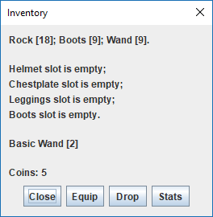
<h3 align = "center"> XP and Levels </h3>

Affects shops and enemy encounter. The image below is the statistics GUI:

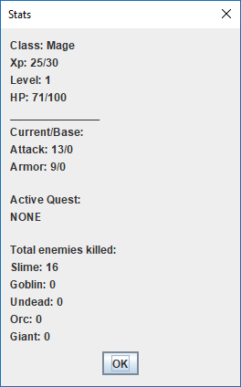

<h3 align = "center"> Class </h3>

* Classes do 1.5x more damage with their weapons
  * Swordsman => sword
  * Archer => Bows
  * Mage => Wands
  
Who'd've thunk it?

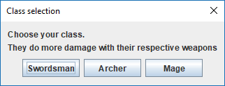
 
 ## Encounters
<h3 align = "center"> Enemy </h3>
 
 * Slime, Goblin, Undead, Orc, Giant
   * Do more damage, have higher defence, (higher stats in general) the further right
 * Main way to get coins and levels
 * Most common encounter
 
 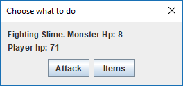
 
<h3 align = "center"> City </h3>

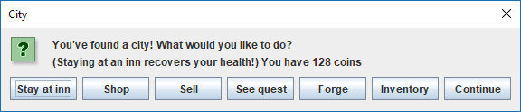
 
* Randomly generated
* Chance to spawn with:
  * Shop
    * Buy & sell items
    * Randomly generated items
    * 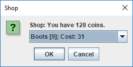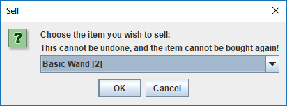
  * Inn
    * Heal health
    * 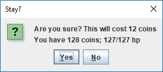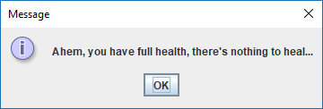
  * Forge
    * Upgrade tools with rocks and coins
    * 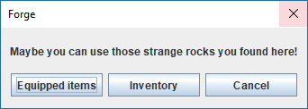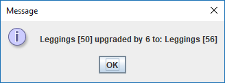
  * Quest
    * Kill enemies for coins
    * Only one quest can be accepted at a time
    * 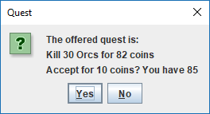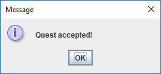
* Saved on the map, so you can go back and buy an item that was previously too expensive for you, or access the quest/forge/inn that existed there!
* Second most common encounter

 
<h3 align = "center"> Wandering Trader </h3>
  
* Buy randomly generated items only
  * Cheaper and better items
* Once you leave, you cannot go back, he wanders away. (It is not saved on the map)
* Rarest encounter

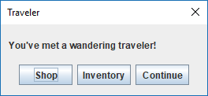

<h3 align = "center"> Rocks </h3>
 
Sometimes you're wandering around and a litte glimmer catches your eye. You find some rocks that look to be of some value. These can be used in the forge to upgrade your items

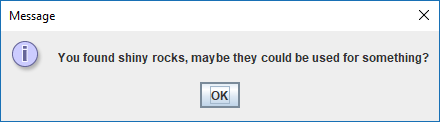
 
## Map

The map is stored in the save folder, and is randomly generated as you walk around. The Boss areas are generated in advance, in one location that per multiple of 100 (x/y) up to 1000, 10 spaces radius. 
The below image is a representation of the boss spawning. Red is any coordinate at a mutiple of 100, up to 1000. Boss will spawn anywhere inside the black box. 
The map can be shown at all times if the user chooses. (Persistant map)

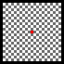
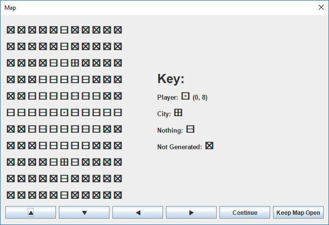
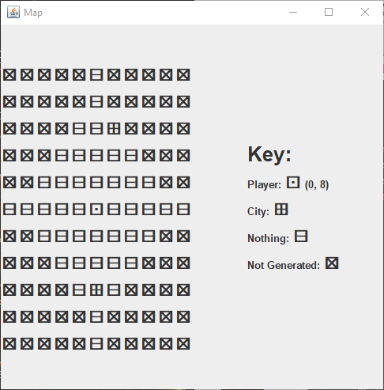

## Saving and Loading

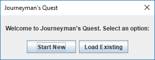

<h3 align = "center"> Saving </h3>

* Start a new game
* Saves after every move
* Saves when closed or when user selects "Exit and Save" (duh)
* Player details and the map are saved (Cities included with the map)

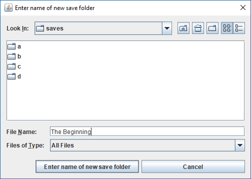

<h3 align = "center"> Loading </h3>

* Does what you expect
* Loads the information like character data and map data
* 's pretty neat

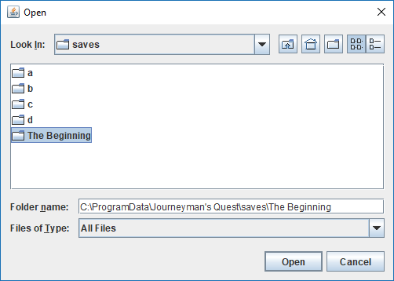

## Flow Chart
 

## Video

 Click image or: <a href="https://youtu.be/fryWuiGTE58">here</a>
